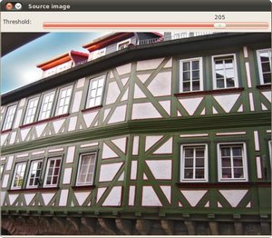
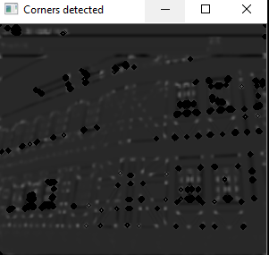
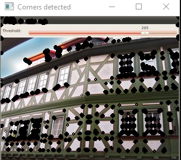

# Harris-corner-detector
This is the C++(openCV) code for a Harris Corner Detector. The code hasn't used cornerHarris() function, instead it has been an attempt to dive into the depth of this function and making it from the one of the most basic filters and operators of openCV. The threshhold and the value of k have been taken according to general standards.

Original image:           |  The marked corner image: | Marked in colour: |
:-------------------------:|:-------------------------:-------------------:
             |      | |

The first image shows the originalimage whereas the second image shows the image after applying Harris Corner Detection Algorithm, All the **detected corners** are displayed as black dots on the corrosponding image. 

### The Self Made harris Corner Detection Function

The function follows the Harris Corner Detection Algorithm which can be summed up in through these steps:

1. Find the gradient/differentials of the given grey scale image for **each pixel** using the Sobel's operator.
2. Calculate Ix,Iy and Ixy using the above differentials through *pow()* and *multiply()* functions(The Ix and Iy will be squared).
3. Apply a **Gaussinan blur** on all the Ix,Iy and Ixy matrices found in the previous steps(Ixg,Iyg and Ixyg).
4. Mulitiply Ixg^2 with Iyg^2, similarly find Ixyg^2. Find trace by adding Ixg^2 and Iyg^2.
5. Find R=dst=Det-k*(trace)^2.
6. Set a threshhold and check while iterating over each and every pixel.

